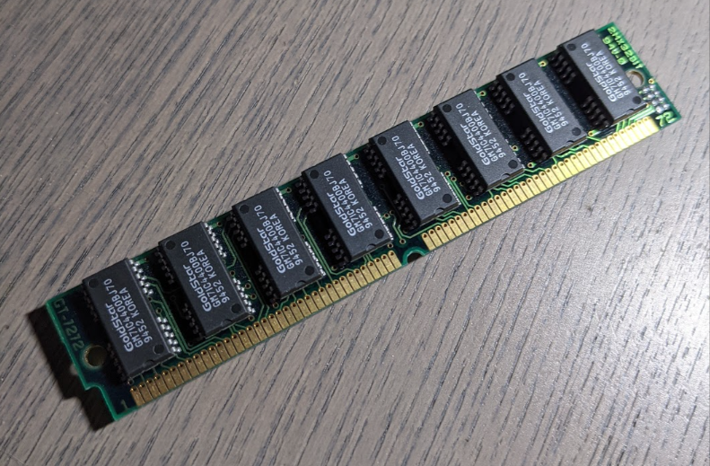

# 1M-30pinsimm

KiCAD design for a 1MByte 30 pin SIMM Fast Page Mode Dynamic Random Access Memory Module Design

WORK IN PROGRESS - Dont let your blue smoke out.

## Real Boards

Boards back from JLCPCB

Seated in test socket fine, aliginmet is great

## Test Chips

Donor 72pin dual sided ram, 99cent ebay find which has enough chips for 8 boards. 

